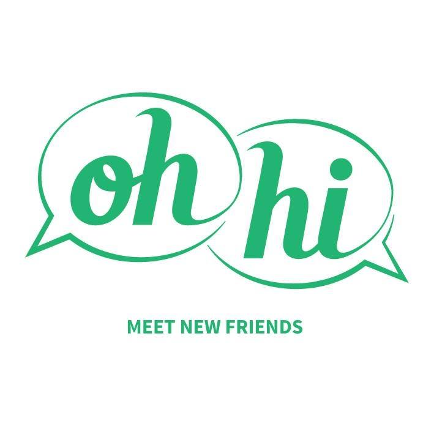
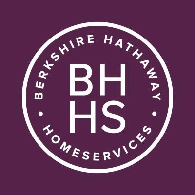
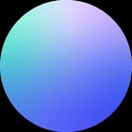

  

<h3>Making all kinds of cool things in Austin, TX</h3>

I'm a software engineer specializing in User Experience and Front-End development, although I consider myself a code generalist and get excited about solving just about any problem. 

Always looking to discuss new adventures, open source, SVG animation, shih-tzus, and pizza opportunities.

<h3>Cool cats I've worked with</h3>

    
    
    
    
    
    

<h3>In my spare time I'm</h3>

* creating surface pattern designs & turning ideas into quilts, iOS sticker packs, clothes, wallpaper, you name it. 
* thinking about Star Wars.
* eating good food.
* traveling and/or making future plans to.
* watching horror movies.

<h3>hmu.</h3>

    
    

